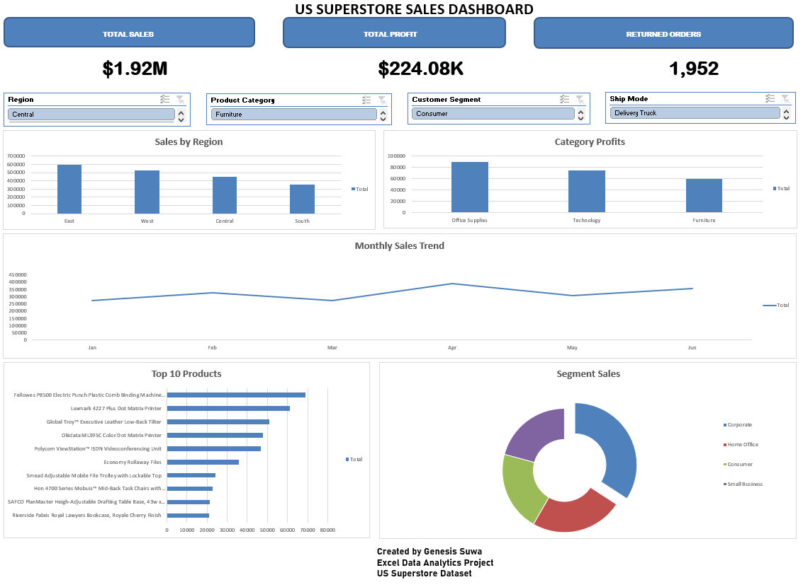

# 📊 US Superstore Excel Dashboard

Interactive Excel dashboard I built using the US Superstore dataset to analyze sales, profit, returned orders, and product performance through Pivot Tables, Pivot Charts, KPI Cards, and Slicers.

---

## 🎯 Objectives

- Clean and prepare the dataset.
- Perform Exploratory Data Analysis (EDA).
- Build interactive Pivot Tables and Pivot Charts.
- Create KPI Cards.
- Design an interactive dashboard using Slicers.

## 🛠️ Tools Used

- Microsoft Excel
- Pivot Tables
- Pivot Charts
- Slicers
- Data Cleaning
- Exploratory Data Analysis (EDA)

## 📈 Key Performance Indicators (KPIs)

- Total Sales: **$1.92M**
- Total Profit: **$224.08K**
- Returned Orders: **1,952**

## 📊 Dashboard Visualizations

- Sales by Region
- Category Profit
- Monthly Sales Trend
- Top 10 Products by Sales
- Segment Sales Distribution

## 🔍 Key Insights

- The business generated total sales of **$1.92M**.
- Total profit reached **$224.08K**.
- Sales performance differs across regions and East has the highest sales.
- Monthly sales show changing trends over time.
- A small group of products contributes significantly to total revenue.

## 🖼️ Dashboard Preview

## 📂 Files Included

- US_Superstore_Excel_Dashboard.xlsx
- Dashboard_Screenshot.png
- README.md

## 👨‍💻 Author

**Genesis Suwa**

 Data Analyst

Skills:
- Excel
- SQL
- Power BI
- Python

  
- SQL
- Power BI
- Python
